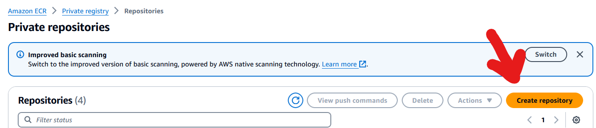
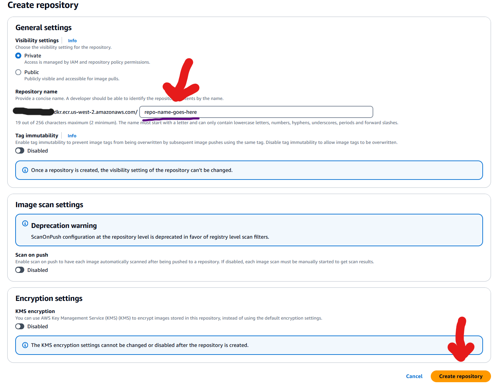
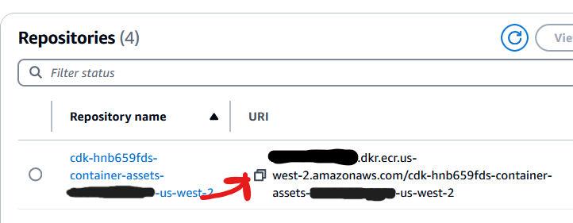
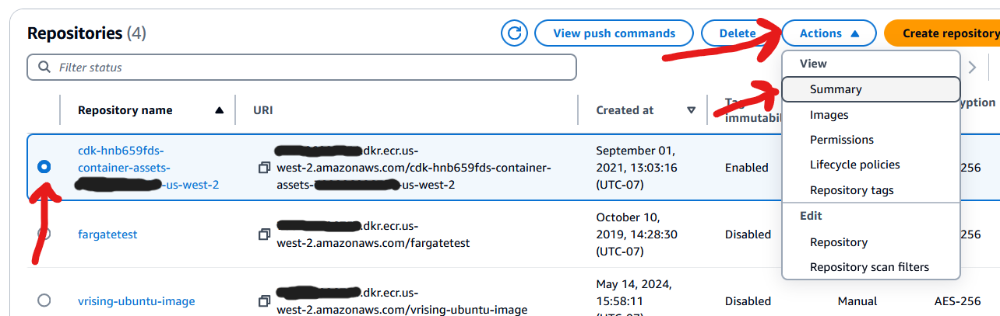
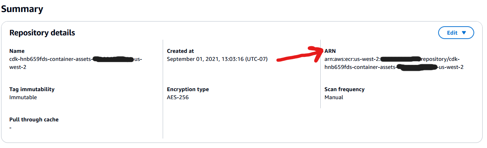
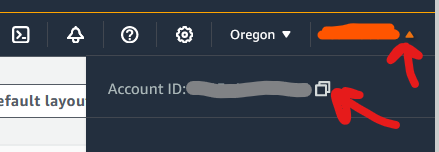
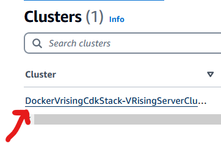
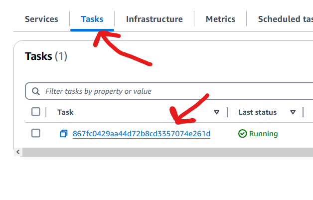
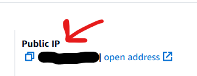

# docker-vrising-cdk

This package is a CDK application based on [trueosiris's Dockerized V Rising server](https://github.com/TrueOsiris/docker-vrising) that has been optimized for hosting in AWS Elastic Container Service (ECS) Fargate and written as an AWS Cloud Development Kit (CDK) application.

In addition to hosting your Dedicated V Rising server as a Docker container in ECS, this package will also automatically backup and restore your V Rising save files in the event your server goes offline.

[AWS CDK](https://www.google.com/url?sa=t&source=web&rct=j&opi=89978449&url=https://aws.amazon.com/cdk/&ved=2ahUKEwjjraHJl5OGAxXaGDQIHf4eD1kQFnoECBUQAQ&usg=AOvVaw2tPZlF03QH3o_EKwTkN7cO) is an open source development kit that makes it very easy to model AWS resources as code, and automatically deploys and configures those resources for you using Cloud Formation. [ECS Fargate](https://www.google.com/url?sa=t&source=web&rct=j&opi=89978449&url=https://docs.aws.amazon.com/AmazonECS/latest/developerguide/AWS_Fargate.html&ved=2ahUKEwikmv3cp5OGAxXaDjQIHQvpCVAQFnoECAcQAQ&usg=AOvVaw25qOhg3iVUXaDcz4N6hF_G) is a serverless container hosting service. The benefit of building this package as a CDK application is that you can deploy all the necessary AWS infrastructure needed to host your Dockerized V Rising server in ECS Fargate with a single command, after setting up some prerequisites.

This application will deploy the bare minimum set of infrastructure needed to host a V Rising server in AWS, and since we're using ECS Fargate, we won't need to manage any actual servers and the costs of running the container fall within the AWS free tier. If you want to host a Dedicated/Private V Rising server for free, then you should use this package.

## Prerequisites

To deploy this package to your AWS account, you'll need the following:

1 - A free [Amazon Web Services](https://portal.aws.amazon.com/gp/aws/developer/registration/index.html?refid=em_127222&p=free&c=hp&z=1) account (all of the infrastructure this package deploys falls within the AWS free tier).

2 - [NPM](https://www.google.com/url?sa=t&source=web&rct=j&opi=89978449&url=https://www.npmjs.com/&ved=2ahUKEwiZ9Ov0l5OGAxVzHjQIHQbxBnAQFnoECBkQAQ&usg=AOvVaw3X687KpYu1DK9666uZ55b8) installed on your local machine.

3 - The [AWS CLI](https://docs.aws.amazon.com/cli/latest/userguide/getting-started-install.html) installed on your local machine.

4 - AWS CDK installed on your local machine. After you've installed NPM, run:
```
npm install -g aws-cdk
```

5 - [Docker Engine](https://www.google.com/url?sa=t&source=web&rct=j&opi=89978449&url=https://docs.docker.com/engine/install/&ved=2ahUKEwiaq6T1nZOGAxV3GjQIHRuVBrQQFnoECBEQAQ&usg=AOvVaw3oxUtu6GW_HNWz3ZCPMLU_) installed on your local machine.

After you've set up these prerequisites, pull down this package from Github.

## Customizing Your V Rising Server

Before you deploy your V Rising server, you'll need to customize a few things. 

- `REQUIRED:` In the `src\ServerHostSettings.json` file that you downloaded with this repository, you'll want to configure your server's name and description.
- `OPTIONAL:` If you want your server to be private, set the value of `Secure` to `true`, and you'll need to set the `Password` field.
```
src\ServerHostSettings.json
{
    "Name": "UPDATE YOUR SERVER NAME HERE",
    "Description": "UPDATE YOUR SERVER DESCRIPTION HERE",
    ...
    "Password": "UPDATE YOUR SERVER'S PASSWORD HERE, OR LEAVE IT BLANK IF YOU WANT YOUR SERVER TO BE PUBLIC",
    "Secure": Set to `true` or `false`, depending on whether you want your server to be password protected,
    ...
  }
```
- `REQUIRED:` In the `src\Dockerfile` file, modify the value of `ServerName` on line 7:
```
src\Dockerfile
ENV ServerName='Set what you want your server's name to be here - this will be what it's listed by on the V Rising server browser'
```

- `OPTIONAL:` If you want to manage your server with an Rcon client, then you'll want to modify the `Rcon` section at the bottom of the `ServerHostSettings.json` file.
```
src\ServerHostSettings.json
"Rcon": {
      "Enabled": true,
      "Port": 25575,
      "Password": "RCON PASSWORD GOES HERE"
    }
```
- `OPTIONAL:` If you want to modify any of the game's settings, you'll want to do so in the `GameHostSettings.json` file that you downloaded with this repository. There are some quality of life improvements you can make in these settings, such as setting `TeleportBoundItems` to `false`, but if you don't know enough about V Rising to know what these settings do, then you can leave them at their defaults.

## Deploying Your V Rising Server

After installing all of the prerequisites and setting your Server's name in `src\ServerHostSettings.json` and  `src\Dockerfile`, you'll want to build your Docker image and store it AWS Elastic Container Registry. While the CDK Application deploys all of the infrastructure you need to host your Docker container in AWS, it won't finish deploying unless there is an existing container for it to pull down during deployment.

1 - Log in to your AWS account in the [AWS console](https://www.google.com/aclk?sa=l&ai=DChcSEwjsibukn5OGAxXxLa0GHWLjChIYABAAGgJwdg&gclid=Cj0KCQjw3ZayBhDRARIsAPWzx8plByjt4aFLlKfmarSSvpzQqTzR3HnLUxmIOCln4Il9UVRjlcXKtFoaAtUREALw_wcB&sig=AOD64_1E3eyUe2zzPl2B-jp1uKXobWgDMw&q&adurl&ved=2ahUKEwj9qrSkn5OGAxV0BDQIHYWgDMUQ0Qx6BAgIEAE).

2 - Navigate to [Elastic Container Registry](console.aws.amazon.com/ecr).

3 - Click `Create Repository`.


4 - Type whatever name you want for your repository in the `Repository name` field. Leave all the other settings alone and click `Create Repository`


5 - Next, you'll need to copy some of your Repository's information into the `src\config.json` file. All of this information can be found in the AWS console. The values you need to set are:

`EcrRepoUri` - You can copy this value by clicking the boxes next to your Repository Name in the ECR console:


`EcrRepoArn` - This is the Amazon Resource Name (ARN) of your Elastic Cointainer Registry. To find this, select your Repository in the ECR console, click the `Actions` button, then click `Summary`. Your Registry's ARN will be listed in the right hand corner.



`Region` - The AWS region you want to deploy your server in. By default, this package selects `us-west-2`. If you want to deploy it on the east coast, you could change this to `us-east-1`.

`AccountId` - The Account ID of your AWS account. You can find this by clicking your username in the top right hand corner of the AWS console (alternatively, you can copy everything before the first `.` in your `EcrRepoUri`. This is your account number.)


Finally, your config.json should have these values customized:
```
src\config.json
{
  ...
  "EcrRepoUri": "123456789.dkr.ecr.us-west-2.amazonaws.com",
  "EcrRepoArn": "arn:aws:ecr:us-west-2:123456789:repository/YourElasticContainerRegistryName",
  "Region": "us-west-2",
  "AccountId": "123456789"
}
```

You're ready to deploy your V Rising server. All of the following commands should be run from a terminal in the root directory of this package:

1 - First, you need to configure your AWS CLI for local use - open a terminal and type `aws configure`. You'll need to copy in some credential information from your AWS account. If you're new to or unfamiliar with AWS, [follow the instructions in this guide](https://docs.aws.amazon.com/cli/latest/userguide/getting-started-quickstart.html) (see the `Manually editing the credentials and config files` section).  

2 - Next, you need to build your Docker image and upload it to ECR. The `Build-VRisingServerImage.ps1` or `BuildVRisingServerImage.sh` scripts included in this package will do this for you. Run one of those scripts after authenticating with the AWS CLI (you may run either depending on which shell you prefer - if you're on Windows, I recommend running `Build-VRisingServerImage.ps1`).

3 - After your Docker image is built and the script has uploaded it to ECR, deploy your CDK package by running `cdk deploy`.

## Connecting to Your V Rising Server

Your V Rising server is now running in ECS. It may take some time for it to appear in the V Rising server browser. If you'd like to connect to the server directly, click the `Direct Connect` button in the V Rising server browser and type in your server's IP address and game port. To find your server's IP address: 

1 - Go to the [ECS Console](console.aws.amazon.com/ecs/v2/clusters).

2 - Click the `Cluster` that was created by the CDK application:


3 - Click `Tasks`, then click on the running task.


4 - Your server's public IP address will be displayed on right-hand side of the `Configuration` window:


## Save File Backup and Restore

This package includes a file named `backup.sh` in your Docker image which will regularly back up your V Rising save data to an S3 bucket created as part of the CDK application. In the event your server crashes or goes offline for some reason, the Docker image is built so that it will download any save files present in this S3 bucket once the server comes back online. In this section of the docker-vrising-cdk.ts file:
```
lib\docker-vrising-cdk-stack.ts
healthCheck: {
            command: ["sh", "-c", "ps -A | grep 'VRisingServer*' | grep -v grep"],
            startPeriod: cdk.Duration.seconds(300), // Adjust as needed
```
I've configured Fargate to run a health check every 5 minutes to see if the V Rising Server executable is running in our container. If it isn't Fargate will automatically tear down our container and deploy a new one. Once our container is redeployed, it runs a command that will download any save files that are in this bucket so that your game is in the same state as it was before your server went offline.

## What Infrastructure Does This Create?

This CDK application creates the bare minimum amount of infrastructure you need to host a container in AWS. I'm using ECS Fargate for this, since you can host containers in Fargate without having to build and manage any underlying EC2 instances, which dramatically reduces costs. All of the infrastructure is defined in the `lib/docker-vrising-cdk-stack.ts` file.

## OPTIONAL - Modifying the Default Port Settings

- I don't recommend changing any of the port settings since this package comes with the default ones already configured. These default settings are required to show up in the V Rising server browser. But, if you do want to change the default port settings, then you'll need to make them in a couple of places:

1 - Update the values of `Port` and `QueryPort` in the `ServerHostSettings.json` file (the value of `Port` will be the port number that your players are required to type in when direct connecting to your server.)
```
    "Port": 9876,
    "QueryPort": 9877,
```

2 - Update the values of `GamePort` and `QueryPort` in `src\Dockerfile`. On lines 8 and 9:
```
ENV GamePort=9876
ENV QueryPort=9877
```

3 - Finally, Update the vales of `"GamePort"` and `"QueryPort"` in `src\config.json`. On lines 2 and 3:
```
  "GamePort": 9876,
  "QueryPort": 9877,
```
